# Autonomous Loop — Issue Flow and Decision Tree

How an issue travels from its source, into the cron-driven loop, through every
decision the loop makes, to one of its terminal states. The flow is **abstracted
over repo type** — the loop is fleet-wide and repo-agnostic; the only repo-shaped
fork shown is `scope:iac` (which agent builds it) and the no-app vs. app behaviour
folded into the review battery (ADR-0024). There is intentionally no per-repo split.

Source of truth: `triage-scan.yml`, `claude-implementer.yml`, `claude-pr-review.yml`,
and ADR-0016 / 0017 / 0019 / 0020 / 0021 / 0023 / 0024 / 0025 / 0026 / 0027 / 0028.

**Legend**

- 🟩 green — work completed (issue closed)
- 🟧 amber — handed to the human (a deliberate checkpoint, not a failure)
- ⬛ grey — parked, re-evaluated on a later cycle/window
- 🟦 blue — cleanup-sweep (spare-capacity nit draining)

```mermaid
flowchart TD
    %% ===================== ① SOURCES =====================
    subgraph SRC["① Issue sources"]
        direction TB
        S1["code-reviewer<br/>High/Med finding"]
        S2["security-reviewer<br/>finding"]
        S3["test-writer<br/>coverage gap"]
        S4["doc-keeper<br/>doc gap"]
        S5["ci-health<br/>fleet workflow failure"]
        S6["Sentry<br/>production error"]
        S7["dep-watch<br/>reviews dependency PRs"]
        S8A["You / trusted maintainer<br/>filed issue"]
        S8B["Other user · app user / external<br/>feature request or bug"]
        PF["triage-scan Pass 3<br/>process-flaw markers pulled<br/>fleet-wide, refiled on platform repo"]
    end

    S1 --> LBL["Issue filed<br/>labels: severity:*, origin:internal-review"]
    S2 --> LBL
    S3 --> LBL
    S4 --> LBL
    S5 --> CILBL["Issue filed<br/>labels: bug, triage:medium"]
    S6 --> SENT["Issue filed<br/>label: source:sentry"]
    S7 --> DEPAUTO["Auto-merges safe bumps + CVE patches<br/>(patch/minor · tests green) → merged"]
    S7 --> DEPFIND["Files work: major bumps · EOL/deprecation ·<br/>dead-package replacement<br/>severity:* + ready-for-implementer"]
    S7 --> DEPDIGEST["Weekly digest<br/>label: dep-watch"]
    DEPFIND -->|"ADR-0027 · no human gate"| QUEUE
    DEPDIGEST --> DIGSINK["Human info sink ·<br/>read-only, never a gate"]
    S8A --> OPTIN
    S8B --> INERT["Sits inert — cannot self-dispatch<br/>non-maintainers cannot apply labels"]
    INERT --> OPTIN{"Trusted maintainer opts it in?<br/>applies ready-for-implementer / severity:critical<br/>permission-gated — write/triage only"}
    OPTIN -->|yes| FAST
    OPTIN -->|"no — not yet"| OPTINWAIT["Never auto-acted on ·<br/>waits for your review"]
    PF --> QUEUE
    CILBL --> QUEUE

    LBL --> SEV{"Finding severity?"}
    SEV -->|"Low / Nit"| DEFER["deferred-until-adjacent<br/>(ADR-0016)"]
    SEV -->|"Med / High"| QUEUE["Agent-discovered queue<br/>awaits the promoter"]

    SENT --> FAST["Implementer auto-pickup<br/>label-triggered · bypasses promoter + window"]
    QUEUE -. "agent-applied severity:critical also auto-picks-up" .-> FAST

    %% ===================== ② TRIAGE-SCAN LOOP =====================
    subgraph LOOP["② triage-scan loop · cron-driven · platform-central · fleet-wide"]
        direction TB
        WIN{"In window?<br/>overnight 01–04 CT daily ·<br/>work-hours 09–12 CT Mon–Fri ·<br/>manual dispatch always passes"}
        WIN -->|no| WWAIT["Quiet — wait for next window"]
        WIN -->|yes| PROMO{"Promotion eligible? · Tier-2 judgement<br/>· agent-discovered<br/>· severity:med/high or triage:med<br/>· not already ready-for-implementer<br/>· survived at least one cycle (older than ~35 min)<br/>· well-specified, single bounded change"}
        PROMO -->|"no — vague"| NOTPROMO["Leave unpromoted +<br/>comment what is missing<br/>re-evaluated next cycle"]
        PROMO -->|yes| THR{"Within FLEET_MAX_DISPATCH = 6?<br/>severity:high promoted first"}
        THR -->|"no — cap reached"| CAPWAIT["Rest wait for next window"]
        THR -->|yes| DISPATCH["+ ready-for-implementer ·<br/>dispatch the repo's implementer · comment"]
        THR -. "spare slots, but only after ≥1 real promotion · ADR-0028" .-> SWEEP["Dispatch cleanup-sweep · Mode C<br/>to repo with most deferred nits<br/>skip zero-count repos"]
    end

    QUEUE --> WIN
    DEFER -. "bundled when a real fix touches its directory · ADR-0016 'While here'" .-> BUILD
    DEFER -. "or swept on an active cycle · ADR-0028" .-> SWEEP

    %% ===================== ③ IMPLEMENTER =====================
    subgraph IMPL["③ Implementer · Mode A · repo-type-abstracted"]
        direction TB
        IAC{"scope:iac?"}
        IAC -->|yes| IACIMPL["iac-implementer<br/>tofu plan only · no apply · cap 5 resources"]
        IAC -->|no| CG{"Self-change?<br/>process-flaw / changes to ai-team"}
        CG -->|"compositional · standards · security<br/>or n=1 generality"| ARCH["STOP — route to architect<br/>propose ADR · human ratifies"]
        CG -->|"mechanical · or not a self-change"| PHASE{"feature-request without<br/>plan-approved or skip-plan?"}
        PHASE -->|yes| PLAN["PLAN PHASE: post approach,<br/>label awaiting-plan-approval, STOP"]
        PLAN --> PAPP{"Human applies plan-approved?"}
        PAPP -->|"not yet"| PLANWAIT["Waits for human"]
        PAPP -->|yes| SCOPE
        PHASE -->|"no — defect/bug or already approved"| SCOPE{"Within scope cap?<br/>50 LOC · 3 files · 1 component"}
        SCOPE -->|no| REFUSE["Refuse + stop<br/>needs split or human"]
        SCOPE -->|yes| BUILD["Build: branch impl/* ·<br/>code + tests · lint · typecheck · commit"]
        BUILD --> CONF{"Pre-flight rebase clean?"}
        CONF -->|"no — conflict"| CONFWAIT["Abort + comment +<br/>exit without push · retry next dispatch"]
        CONF -->|yes| OPENPR["Push + open PR · Closes #n"]
    end

    FAST --> IAC
    DISPATCH --> IAC
    IACIMPL --> OPENPR

    %% ===================== ④ REVIEW BATTERY =====================
    subgraph REV["④ Review battery · claude-pr-review on the PR"]
        direction TB
        REVIEW["code-review · security-review ·<br/>functional-test · e2e-test ·<br/>test-writer · doc-keeper ·<br/>destructive-change · ensure-labels ·<br/>invoke-architect-if-gated"]
        REVIEW --> VERDICT{"code / security verdict?"}
        VERDICT -->|"BLOCK · Critical/High"| FIXIT{"Prior fix attempts under 3?"}
        FIXIT -->|yes| FIX["Mode B: address findings ·<br/>rebase check · push"]
        FIXIT -->|"no · 3 reached"| ESCAL["Escalate to human ·<br/>stop fix iteration · ADR-0026"]
    end

    OPENPR --> REVIEW
    SWEEP --> REVIEW
    FIX --> REVIEW
    REVIEW -. "files new defects" .-> S1

    %% ===================== ⑤ AUTO-MERGE GATE =====================
    subgraph MERGE["⑤ Auto-merge gate · in-window · as fleet App · per implementer PR"]
        direction TB
        MG0{"AUTONOMOUS_MERGE on?"}
        MG0 -->|off| PAUSED["Paused — held"]
        MG0 -->|on| MG1{"requires-adr:* label?"}
        MG1 -->|yes| HADR["Hold for human · ADR-gated"]
        MG1 -->|no| MG2{"compositional-self-change label?"}
        MG2 -->|yes| HCOMP["Hold for human · ADR-0023"]
        MG2 -->|no| MG3{"Linked issue present and machine-origin?<br/>bot author · source:sentry ·<br/>source:cloudwatch · origin:internal-review"}
        MG3 -->|"no — human-origin or none"| HHUM["Hold for human merge"]
        MG3 -->|yes| MG4{"All required checks green?"}
        MG4 -->|"no · or none reported"| HCHK["Hold — needs green battery"]
        MG4 -->|yes| MG5{"Within per-run cap = 10?"}
        MG5 -->|no| CAPM["Rest wait for next window"]
        MG5 -->|yes| DOMERGE["Squash-merge + delete branch<br/>cascades release-please + deploy"]
        DOMERGE --> MFAIL{"Merge succeeded?"}
        MFAIL -->|no| HFAIL["Merge failed — left for human"]
        MFAIL -->|yes| CLOSED["Issue closed"]
    end

    VERDICT -->|"APPROVE / with-comments"| MG0

    %% ===================== terminal styling =====================
    classDef success fill:#1f7a3d,stroke:#0d4d24,color:#fff;
    classDef human fill:#b06f00,stroke:#7a4d00,color:#fff;
    classDef wait fill:#4a4a4a,stroke:#2a2a2a,color:#fff;
    classDef sweep fill:#264f78,stroke:#16324d,color:#fff;

    class CLOSED,DEPAUTO success;
    class ARCH,PLANWAIT,REFUSE,ESCAL,HADR,HCOMP,HHUM,HFAIL,PAUSED human;
    class WWAIT,NOTPROMO,CAPWAIT,CONFWAIT,CAPM,DEFER,HCHK,INERT,OPTINWAIT,DIGSINK wait;
    class SWEEP sweep;
```

## Terminal states

| State | Colour | Meaning |
|---|---|---|
| Issue closed | 🟩 | Fix merged; the loop did its job end-to-end. |
| Route to architect | 🟧 | Competence gate caught a compositional/standards/security self-change — ADR + human ratify (ADR-0019). |
| Plan waiting | 🟧 | feature-request paused for human `plan-approved` (ADR-0017 plan-gate). |
| Refuse (scope cap) | 🟧 | Change exceeds 50 LOC / 3 files / 1 component — needs a split or human. |
| Escalate (3 attempts) | 🟧 | Mode B couldn't converge in 3 fix iterations (ADR-0026). |
| Hold: ADR-gated | 🟧 | `requires-adr:*` label — one of the five gated categories. |
| Hold: compositional | 🟧 | `compositional-self-change` label (ADR-0023). |
| Hold: human-origin | 🟧 | Linked issue is human-filed — human-merge checkpoint (ADR-0023). |
| Hold: merge failed | 🟧 | Qualified but `gh pr merge` rejected — left for human. *(This was the platform-repo deadlock fixed in ADR-0024.)* |
| Paused | 🟧 | `AUTONOMOUS_MERGE=off`. |
| Wait: window / cap / conflict / checks | ⬛ | Parked, re-evaluated next cycle or window. |
| deferred-until-adjacent | ⬛ | Low/Nit finding — drained later by cleanup-sweep (ADR-0016). |

## Notes

- **Two ways in.** Most agent-discovered work *waits* for the in-window promoter. A small set of **label-triggered** signals bypass it and hit the implementer immediately: `ready-for-implementer`, `severity:critical`, and `source:sentry`.
- **You vs. other users — the separation is permission-enforced.** In every app repo the implementer fires only on a *labeled* event, never on issue-open. Applying those labels requires triage/write access, which app users and external collaborators don't have (and there are no auto-labeling issue templates). So another user's request **sits inert** until a trusted maintainer reviews it and opts it in. The distinction is enforced by GitHub repo permissions on label application, not by an author check in the workflow — which is why it isn't visible in the raw `if:` conditions.
- **Three safeguards against an external request weakening the app.** (1) It can't self-dispatch — needs a maintainer's opt-in label. (2) If it's a `feature-request`, the plan-gate still holds it for your `plan-approved`. (3) The auto-merge gate holds *every* human-origin issue for your manual merge (ADR-0023). A non-maintainer can file, but cannot make the loop build or land anything.
- **Platform opened-path — now owner-gated.** The platform repo (`agentic-dev-environment`) is public and its templates auto-apply `bug` / `feature-request`. Its `opened` pickup (`initial` + `initial-iac`) is now guarded by `author_association == 'OWNER'` (ADR-0025) — the owner's own issues fast-path; anyone else's start *no* work until the owner applies `ready-for-implementer`. This puts the human-in-the-loop checkpoint ahead of implementation, not just merge, matching the app repos. So the "Other user" source above is inert across the whole fleet, platform repo included.
- **The loop generates its own inputs.** The review battery files fresh defects (dashed edge back to sources) — this is why backlog can grow even while the loop runs; throughput, not correctness.
- **Repo abstraction.** The promoter, implementer, review, and merge stages are identical across all fleet repos. The only repo-shaped decisions are `scope:iac` (routes to `iac-implementer`) and app-vs-no-app inside the review battery (resolved by ADR-0024 so required checks always report, never skip).
- **The merge gate is mechanical.** No agent judgement — every branch is decidable from labels, the linked issue's origin, and check state.
