# Autonomous Loop — Issue Flow and Decision Tree

How an issue travels from its source, into the cron-driven loop, through every
decision the loop makes, to one of its terminal states. The flow is **abstracted
over repo type** — the loop is fleet-wide and repo-agnostic; the only repo-shaped
fork shown is `scope:iac` (which agent builds it) and the no-app vs. app behaviour
folded into the review battery (ADR-0024). There is intentionally no per-repo split.

Source of truth: `triage-scan.yml`, `claude-implementer.yml`, `claude-pr-review.yml`,
and ADR-0016 / 0017 / 0019 / 0020 / 0021 / 0023 / 0024 / 0025 / 0026 / 0027 / 0028 / 0029 / 0030 / 0031 / 0032 / 0035 / 0037 / 0038 / 0039 / 0040.

> **Dispatch routing (ADR-0030):** machine-detected work (severity:critical, source:sentry/cloudwatch) flows through the promoter's deterministic, throttled dispatch — **event-dispatch** on the platform repo (immediate), a **central `*/15` urgent-poll** for app repos (they hold no cross-repo credential to be pushed). Human-approved work (`ready-for-implementer`) stays on each repo's **local** trigger — immediate, no throttle needed (humans don't storm). The fleet-wide `FLEET_MAX_DISPATCH` throttle is enforced centrally as a shared **in-flight ceiling** — all three dispatch paths (windowed promoter, event-dispatch, urgent-poll) count concurrent implementer runs through one source of truth (`scripts/fleet-inflight.sh`), so none can dispatch on top of the others' in-flight work.

**Legend — outcome palette** (terminal & parked end-states)

- 🟩 green — work completed (issue closed)
- 🟧 amber — handed to the human (a deliberate checkpoint, not a failure)
- ⬛ grey — parked, re-evaluated on a later cycle/window

**Agent palette** — every *action/choice* node is coloured by the agent that owns it, inside or outside the stage boxes (so the promoter's `EVENTDISP` reads as promoter even though it sits outside the ② Promoter box — folding it in is the pending event-dispatch rework): **teal** = promoter (`triage-bot`), **indigo** = implementer, **purple** = reviewer agents, **steel-blue** = merger (auto-merge gate). **Gold** = the human intake lane (`Ⓗ`, ADR-0036) — the human's own territory, distinct from the amber human-checkpoints the machine hands back to. See *Agent ownership* below.

```mermaid
flowchart TD
    %% ===================== ① SOURCES =====================
    subgraph SRC["① Issue sources"]
        direction TB
        S1["code-reviewer<br/>High/Med finding"]
        S2["security-reviewer<br/>finding"]
        S3["test-writer<br/>coverage gap"]
        S4["doc-keeper<br/>doc gap"]
        S5["ci-health<br/>fleet workflow failure"]
        S6["Sentry<br/>production error"]
        S7["dep-watch<br/>reviews dependency PRs"]
        S8A["You / trusted maintainer<br/>filed issue"]
        S8B["Other user · app user / external<br/>feature request or bug"]
    end

    S1 --> LBL["Issue filed<br/>labels: severity:*, origin:internal-review"]
    S2 --> LBL
    S3 --> LBL
    S4 --> LBL
    S5 --> CILBL["Issue filed<br/>labels: bug, triage:medium"]
    S6 --> SENT["Issue filed<br/>label: source:sentry"]
    S7 --> DEPAUTO["Auto-merges safe bumps + CVE patches<br/>(patch/minor · tests green) → merged"]
    S7 --> DEPFIND["Files work: major bumps · EOL/deprecation ·<br/>dead-package replacement<br/>severity:* + ready-for-implementer"]
    S7 --> DEPDIGEST["Weekly digest<br/>label: dep-watch"]
    DEPDIGEST --> DIGSINK["Human info sink ·<br/>read-only, never a gate"]
    subgraph INTAKE["Ⓗ Human intake · GitHub backlog — you own the &quot;what&quot; (ADR-0036)"]
        direction TB
        CAPTURE["Capture · label: needs-formulation<br/>non-maintainers file · cannot dispatch"]
        FORM{"Formulation — scope + discern<br/>you + Claude · grooming ritual TBD (placeholder)"}
        APPROVED["Approved · label: approved<br/>feature → promoter @ medium tier<br/>(confirmed bug rides its real severity)"]
        PARKED["Parked · closed + label · saved, reopenable"]
        CAPTURE --> FORM
        FORM -->|"approve"| APPROVED
        FORM -->|"reject"| PARKED
        PARKED -. "re-request / 2nd thoughts reopen" .-> FORM
    end
    S8A --> FORM
    S8B --> CAPTURE
    APPROVED -. "optional fast-track · you apply ready-for-implementer" .-> EVENTDISP

    SENT --> EVENTDISP["Promoter deterministic dispatch · ADR-0030<br/>machine work: event-dispatch (platform) · urgent-poll (app repos)<br/>throttled to FLEET_MAX_DISPATCH · no LLM"]

    %% ===================== ② PROMOTER (triage-bot) =====================
    subgraph LOOP["② Promoter · triage-bot · cron-woken · platform-central · fleet-wide"]
        direction TB
        QUEUE["Promoter consideration queue<br/>agent findings + approved features<br/>awaits the promoter"]
        PF["triage-scan Pass 3<br/>process-flaw markers pulled<br/>fleet-wide, refiled on platform repo"]
        WIN{"In window?<br/>overnight 01–04 CT daily ·<br/>work-hours 09–12 CT Mon–Fri ·<br/>manual dispatch always passes"}
        QUEUE --> WIN
        WIN -->|no| WWAIT["Quiet — wait for next window"]
        WIN -->|yes| EVALALL["①·triage EVERY open finding · full pass<br/>exhaustive — the cap does NOT gate evaluation"]
        EVALALL --> STALECHECK{"Stale-citation check · pre-LLM · ADR-0040<br/>scripts/stale-citation-check.sh<br/>do cited paths exist on HEAD?"}
        STALECHECK -->|"STALE — all paths absent"| CLOSESTALE["Auto-close stale finding · comment<br/>names removing commit/PR · reopenable<br/>no agent-quality feedback"]
        STALECHECK -->|"PRESENT / NO_PATHS"| PROMO
        PROMO{"per item: promotion eligible? · Tier-2 judgement<br/>· agent-discovered finding (severity:med/high · triage:med)<br/>· OR an approved feature → ranks medium (ADR-0036)<br/>· not already ready-for-implementer<br/>· survived at least one cycle (older than ~35 min)<br/>· well-specified, single bounded change"}
        PROMO -->|"no — vague"| DISAMB{"Promoter can disambiguate<br/>from the code? · ADR-0031"}
        DISAMB -->|"yes — enrich body"| ENRICH["Rewrite issue with missing<br/>repro/acceptance criteria · comment"]
        ENRICH --> PROMSET
        DISAMB -->|no| CLOSEV["Auto-close vague issue · comment<br/>malformed agent finding — linked, not lost"]
        CLOSEV --> AQUAL["File/append agent-quality issue · platform repo<br/>deduped per source agent · names missing field + spec file"]
        PROMO -->|yes| PROMSET["②·promotable set ·<br/>collected across the whole pass"]
        PROMSET --> RANK{"③·rank the set by severity, then dispatch<br/>top N within AVAILABLE = max(0, 6 − fleet in-flight)<br/>shared FLEET_MAX_DISPATCH ceiling · severity:high before any medium"}
        RANK -->|"top N"| DISPATCH["+ ready-for-implementer ·<br/>dispatch the repo's implementer · comment"]
        RANK -->|"beyond cap"| CAPWAIT["Rest wait for next cycle ·<br/>re-ranked next pass — not dropped"]
        CAPWAIT -. "re-ranked next pass — re-enters eligibility" .-> PROMO
        AQUAL -. "cap-exempt · dedup-bounded · ADR-0031" .-> DISPATCH
        RANK -. "spare slots, but only after ≥1 real promotion · ADR-0028" .-> SWEEP["Promoter dispatches a cleanup-sweep (Mode C) ·<br/>spare slots only · to the repo with the most<br/>deferred nits · skip zero-count repos"]
        PROMO -->|"Low / Nit — defers by severity (ADR-0037)"| DEFER["deferred pool ·<br/>severity:low / severity:nit (ADR-0037)"]
        DEFER -. "reconsidered every pass — re-enters eligibility (guarded self-loop)" .-> PROMO
        DEFER -. "pulled into a real dispatch only on an adjacent same-file change · ADR-0029" .-> DISPATCH
        DEFER -. "or swept on an active cycle · ADR-0028" .-> SWEEP
    end

    %% cross-boundary edges into the Promoter's consideration queue (sources → ②)
    LBL --> QUEUE
    CILBL --> QUEUE
    DEPFIND -->|"ADR-0027 · no human gate · ready-for-implementer at creation"| EVENTDISP
    APPROVED --> QUEUE
    PF --> QUEUE
    QUEUE -. "agent-applied severity:critical" .-> EVENTDISP

    %% ===================== ③ IMPLEMENTER =====================
    subgraph IMPL["③ Implementer · Mode A · repo-type-abstracted"]
        direction TB
        IAC{"scope:iac?"}
        IAC -->|yes| IACIMPL["iac-implementer<br/>plan-only authoring · agent never applies<br/>(deploy cascade applies post-merge) · cap 5 resources"]
        IAC -->|no| CG{"Self-change?<br/>process-flaw / changes to ai-team"}
        CG -->|"would change the team's own process:<br/>compositional · standards · security ·<br/>rail-enforcer agent · or generalizing a fix<br/>from one project's report (Std 12, n=1)"| ARCH["STOP build · file as self-change<br/>needs-formulation + requires-adr (ADR-0038)"]
        CG -->|"mechanical · additive agent-output<br/>tightening (ADR-0032) · or not a self-change"| SCOPE{"Fits one slice?<br/>400 LOC · 8 files · 3 components"}
        SCOPE -->|"no — too big"| SLICE["Decompose (ADR-0026 amend) ·<br/>re-scope to smallest coherent slice ·<br/>file remainder follow-up · Refs #n not Closes"]
        SLICE --> BUILD
        SLICE -. "remainder = follow-up issue, re-dispatched next cycle" .-> QUEUE
        SCOPE -->|yes| BUILD["Build: branch impl/* ·<br/>code + tests · lint · typecheck · commit"]
        BUILD --> CONF{"Pre-flight rebase clean?"}
        CONF -->|"no — conflict"| CONFWAIT["Abort + comment +<br/>exit without push · retry next dispatch"]
        CONF -->|yes| OPENPR["Push + open PR · Closes #n"]
    end

    EVENTDISP --> IAC
    DISPATCH --> IAC
    IACIMPL --> OPENPR
    ARCH -. "enters human formulation · architect drafts ADR · you ratify (ADR-0019/0038)" .-> FORM

    %% ===================== ④ REVIEW BATTERY =====================
    subgraph REV["④ Review battery · claude-pr-review on the PR"]
        direction TB
        REVIEW["code-review · security-review ·<br/>functional-test · e2e-test ·<br/>test-writer · doc-keeper ·<br/>destructive-change · ensure-labels ·<br/>invoke-architect-if-gated"]
        REVIEW --> VERDICT{"code / security verdict?"}
        VERDICT -->|"BLOCK · Critical/High"| FIXIT{"Prior fix attempts under 3?"}
        FIXIT -->|yes| FIX["Mode B: address findings ·<br/>rebase check · push"]
        FIXIT -->|"no · 3 reached"| ESCAL["Escalate to human ·<br/>stop fix iteration · ADR-0026"]
    end

    OPENPR --> REVIEW
    SWEEP --> SWEEPIMPL["implementer · Mode C cleanup-sweep<br/>drains the repo's deferred nits · opens a PR"]
    SWEEPIMPL --> REVIEW
    FIX --> REVIEW
    REVIEW -. "files new defects" .-> S1

    %% ===================== ⑤ AUTO-MERGE GATE =====================
    subgraph MERGE["⑤ Auto-merge gate · in-window · as fleet App · per implementer PR"]
        direction TB
        MG0{"AUTONOMOUS_MERGE on?"}
        MG0 -->|off| PAUSED["Paused — held"]
        MG0 -->|on| MG1{"requires-adr:* label?"}
        MG1 -->|yes| HADR["Hold for human · ADR-gated"]
        MG1 -->|no| MG3{"Implementer-authored and linked issue present?<br/>origin no longer gates the merge (ADR-0039)<br/>human gate moves to test→prod (#179)"}
        MG3 -->|"no"| HNOISS["Hold — not implementer-authored<br/>or no linked issue"]
        MG3 -->|yes| MGIAC{"scope:iac? · ADR-0035"}
        MGIAC -->|"yes — merge == apply on dev"| IACGUARD{"iac-additive-guard check pass?<br/>tofu plan: no destroy/replace ·<br/>≤5 resources · no exposure"}
        IACGUARD -->|"no / absent — unverified"| HIAC["Hold for human merge ·<br/>destroy/replace/exposure or no guard"]
        IACGUARD -->|yes| MGGUARD
        MGIAC -->|no| MGGUARD{"capability-delta guard · ADR-0047<br/>gate/governance file, guardrail vocab,<br/>net-new action, or destructive migration?"}
        MGGUARD -->|"hold: capability/control delta"| HSELF["Hold for human ratification ·<br/>capability-delta firewall (ADR-0019/0047)"]
        MGGUARD -->|"in-lane: capability-neutral"| MG4{"All required checks green?"}
        MG4 -->|"no · or none reported"| HCHK["Hold — needs green battery"]
        MG4 -->|yes| MG5{"Within per-run cap = 10?"}
        MG5 -->|no| CAPM["Rest wait for next window ·<br/>re-considered next pass — not dropped"]
        CAPM -. "re-considered next window" .-> MG0
        MG5 -->|yes| DOMERGE["Squash-merge + delete branch<br/>cascades release-please + deploy"]
        DOMERGE --> MFAIL{"Merge succeeded?"}
        MFAIL -->|no| HFAIL["Merge failed — left for human"]
        MFAIL -->|yes| APPLY["deploy cascade · push:main → tofu apply on dev<br/>(IaC) · release path → prod · ADR-0035"]
        APPLY --> CLOSED["Issue closed"]
    end

    VERDICT -->|"APPROVE / with-comments"| MG0

    %% ===================== terminal styling =====================
    classDef success fill:#1f7a3d,stroke:#0d4d24,color:#fff;
    classDef human fill:#b06f00,stroke:#7a4d00,color:#fff;
    classDef intake fill:#5f5326,stroke:#b9a14a,color:#fdf6d8;
    classDef wait fill:#4a4a4a,stroke:#2a2a2a,color:#fff;

    %% Agent ownership — every action/choice node carries its OWNING agent's
    %% colour, inside or outside the stage boxes. So the promoter's EVENTDISP
    %% and sweep dispatch read as promoter even though they sit outside ②.
    %% Terminal end-states keep the outcome palette above.
    classDef promoter fill:#0e5057,stroke:#1fa3bf,color:#eaffff;
    classDef implementer fill:#2e2f70,stroke:#5560c8,color:#eaeeff;
    classDef reviewer fill:#5e2a6e,stroke:#9a5bb5,color:#f7eaff;
    classDef merger fill:#2b5b8a,stroke:#5a9fd4,color:#eaf6ff;

    class CLOSED,DEPAUTO success;
    class ESCAL,HADR,HNOISS,HIAC,HFAIL,HSELF,PAUSED human;
    class CAPTURE,FORM,APPROVED,PARKED intake;
    class WWAIT,CAPWAIT,CONFWAIT,CAPM,DEFER,HCHK,DIGSINK,QUEUE wait;

    class PF,EVENTDISP,WIN,EVALALL,STALECHECK,CLOSESTALE,PROMO,DISAMB,ENRICH,CLOSEV,AQUAL,PROMSET,RANK,DISPATCH,SWEEP promoter;
    class IAC,IACIMPL,CG,ARCH,SCOPE,SLICE,BUILD,CONF,OPENPR,FIX,SWEEPIMPL implementer;
    class REVIEW,VERDICT,FIXIT reviewer;
    class MG0,MG1,MG3,MGIAC,IACGUARD,MGGUARD,MG4,MG5,DOMERGE,MFAIL,APPLY merger;
```

## Terminal states

| State | Colour | Meaning |
|---|---|---|
| Issue closed | 🟩 | Fix merged; the loop did its job end-to-end. |
| Self-change → formulation | Ⓗ | Compositional self-change filed as `needs-formulation` + `requires-adr`; enters human intake — you scope it and ratify via ADR before it builds (ADR-0019/0038). Routes to Formulation; not a terminal sink. |
| Decompose (scope cap) | — | Change exceeds one slice — the implementer ships the smallest coherent slice and files a follow-up for the remainder; not a terminal, not a human hand-off (ADR-0026 amended). |
| Escalate (3 attempts) | 🟧 | Mode B couldn't converge in 3 fix iterations (ADR-0026). |
| Hold: ADR-gated | 🟧 | `requires-adr:*` label — one of the five gated categories. |
| Hold: compositional | 🟧 | capability-delta guard holds — gate/governance file, guardrail vocab, net-new action, or destructive migration (ADR-0019/0047). |
| Hold: not implementer-authored / unlinked | 🟧 | PR isn't authored by the implementer agent, or has no `Closes/Fixes #n` linked issue — not eligible for autonomous merge. Origin no longer gates the merge (ADR-0039); the human checkpoint moves to test→prod promotion for user-facing features (#179). |
| Hold: IaC unverified | 🟧 | `scope:iac` PR whose `tofu plan` isn't provably safe-additive (destroy/replace/exposure), or has no `iac-additive-guard` check — held for human merge (ADR-0035). |
| Hold: merge failed | 🟧 | Qualified but `gh pr merge` rejected — left for human. *(This was the platform-repo deadlock fixed in ADR-0024.)* |
| Paused | 🟧 | `AUTONOMOUS_MERGE=off`. |
| Wait: window / cap / conflict / checks | ⬛ | Parked, re-evaluated next cycle or window. |
| deferred (severity:low/nit) | ⬛ | Low/Nit finding — defers by severity, drained later by cleanup-sweep (ADR-0016/0037). |
| Parked (rejected idea) | 🟡 | A formulated idea the human rejected — closed + `parked` label, saved and reopenable on a re-request or second thoughts (ADR-0036). Not a failure, not deleted. |
| Auto-closed (malformed finding) | 🟩 | Promoter couldn't disambiguate a vague agent finding — closed, and a fix to the source agent's contract dispatched (ADR-0031). |
| Auto-closed (stale citation) | 🟩 | Promoter's pre-LLM existence check found all cited paths absent from HEAD — closed with a provenance comment naming the removing commit/PR (ADR-0040). Reopenable if the work returns. |

## Agent ownership (node colours)

Every **action/choice** node is coloured by the agent that owns it — so "is the right agent doing the right job" is a glance, and an agent's work is one colour *wherever it sits*, not confined to a stage box. ② is now the **Promoter** box — its actions (window, exhaustive triage, rank, dispatch, vague-handling, Pass-3 process-flaw scan, cleanup-sweep dispatch) plus the `DEFER` pool drawn inside as a grey state-buffer. The consideration `QUEUE` sits at the leading edge of ②, and the promoter's `EVENTDISP` (deterministic, event-driven dispatch) also sits outside ② — pending the event-dispatch rework — but reads promoter-teal regardless. Terminal/parked end-states keep the outcome palette (🟩/🟧/⬛).

| Agent | Colour | Owns (action/choice nodes) |
|---|---|---|
| promoter (`triage-bot`) | teal | the ② Promoter box — window, exhaustive triage, stale-citation check, rank, dispatch, vague-handling, Pass-3 process-flaw scan, cleanup-sweep dispatch **+** `EVENTDISP` (still outside, pending the event-dispatch rework). Grey state-buffers: `DEFER` pool (inside ②), consideration `QUEUE` (inside ②) |
| implementer (+ `iac-implementer`) | indigo | the ③ build flow + the Mode-B fix node |
| reviewer agents | purple | the ④ review-battery decisions |
| merger (fleet App) | steel-blue | the ⑤ auto-merge gate, incl. the ADR-0032 self-change guard |

The **source agents** (① — code-reviewer, ci-health, Sentry, dep-watch, …) and the queue/filing nodes keep the default fill for now; colouring those by agent (and a full per-agent swimlane redraw) is the remaining increment.

## Notes

- **Two ways in.** Most agent-discovered work *waits* for the in-window promoter. A small set of **label-triggered** signals bypass it and hit the implementer immediately: `ready-for-implementer`, `severity:critical`, and `source:sentry`.
- **You vs. other users — the separation is permission-enforced.** In every app repo the implementer fires only on a *labeled* event, never on issue-open. Applying those labels requires triage/write access, which app users and external collaborators don't have (and there are no auto-labeling issue templates). So another user's request **sits inert** until a trusted maintainer reviews it and opts it in. The distinction is enforced by GitHub repo permissions on label application, not by an author check in the workflow — which is why it isn't visible in the raw `if:` conditions.
- **Three safeguards against an external request weakening the app.** (1) It can't self-dispatch — needs a maintainer's label. (2) If it's a `feature-request`, it cannot enter the loop until the maintainer formulates it and applies `approved` (ADR-0036) — a raw request never auto-builds. (3) Any change that touches the team's gates, standards, or security posture carries `compositional-self-change` or `requires-adr:*` and holds for your manual merge (ADR-0019/0039). A non-maintainer can file, but cannot make the loop build or land anything.
- **Platform opened-path — owner-gated and bug/defect-only.** The platform repo (`agentic-dev-environment`) is public and its templates auto-apply `bug` / `feature-request`. The owner-`opened` fast-path (`author_association == 'OWNER'`, ADR-0025) now dispatches **bug/defect only** (ADR-0036) — owner-opened defects fast-path; an owner-opened `feature-request` awaits formulation→`approved` like everyone else's. Anyone else's issues start *no* work until the owner labels them. So the "Other user" source is inert across the whole fleet, platform repo included.
- **The loop generates its own inputs.** The review battery files fresh defects (dashed edge back to sources) — this is why backlog can grow even while the loop runs; throughput, not correctness.
- **Triage is exhaustive; only dispatch is capped — and it ranks first.** Each pass the promoter triages *every* open finding — promoting, deferring, enriching, or auto-closing as it goes — and applies `FLEET_MAX_DISPATCH` only at the end, to the *ranked* promotable set (phases ①→②→③ in the loop). It never stops evaluating because the cap is full, so nothing is skipped for triage; a beyond-cap promotion just waits and is re-ranked next pass, never dropped. Agent-quality self-fixes dispatch **cap-exempt** (dedup-bounded, ADR-0031), so a self-correction can't be starved by routine work.
- **The loop fixes its own labor (ADR-0031).** A vague finding can only originate from one of the loop's own agents — the promoter never evaluates human-authored issues. So when the promoter can't enrich a vague finding from the code, it auto-closes it and dispatches a fix to the *source agent's* contract, same run. Repeated vague output converges to one tracked improvement instead of an immortal, re-commented backlog issue.
- **Stale citations close themselves (ADR-0040).** Before any LLM evaluation, `scripts/stale-citation-check.sh` checks whether each candidate's cited paths still exist on HEAD. A finding whose file was deleted or reverted is immortal — "re-evaluate next cycle" is a no-op on an absent path. The deterministic check closes it with a provenance comment (the removing commit/PR) for zero LLM tokens, and shrinks the evaluation set every pass thereafter.
- **Repo abstraction.** The promoter, implementer, review, and merge stages are identical across all fleet repos. The only repo-shaped decisions are `scope:iac` (routes to `iac-implementer`) and app-vs-no-app inside the review battery (resolved by ADR-0024 so required checks always report, never skip).
- **The merge gate is mechanical.** No agent judgement — every branch is decidable from labels, whether a linked issue is present, and check state.
